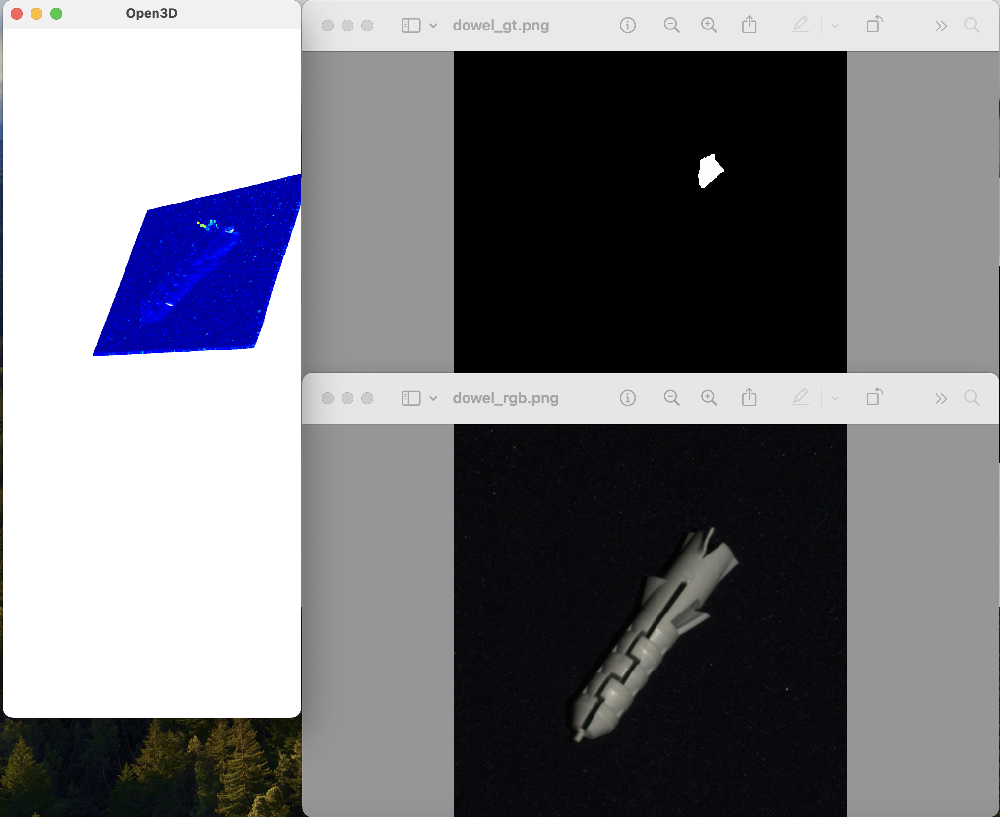
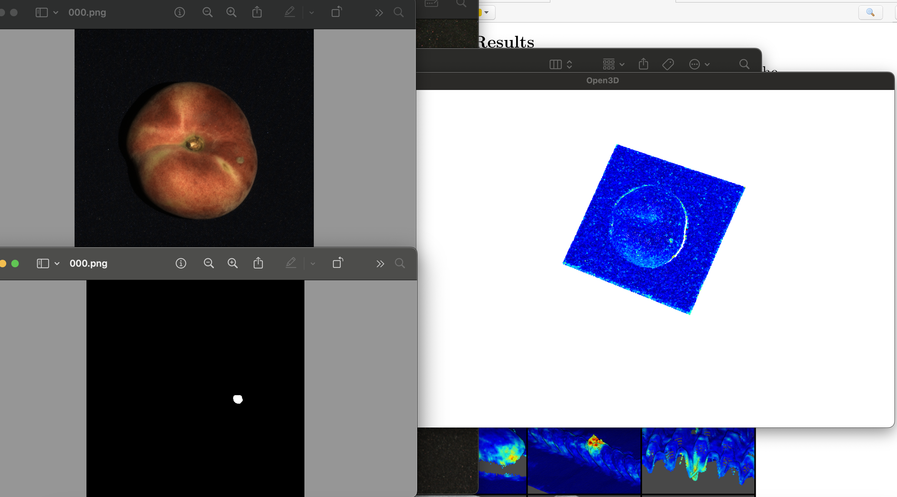
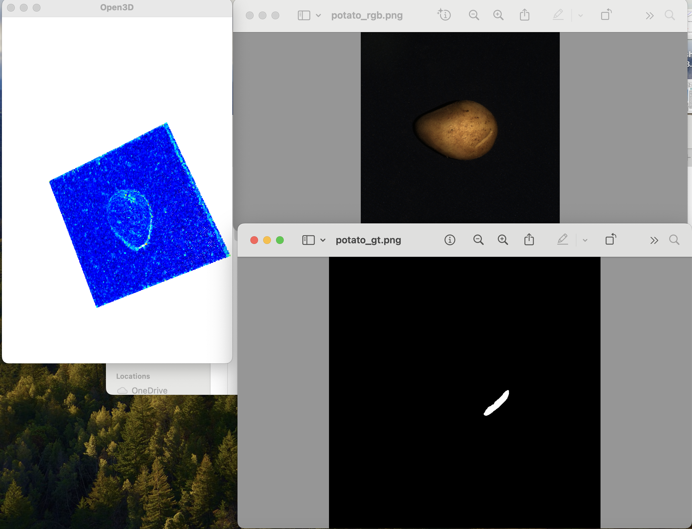
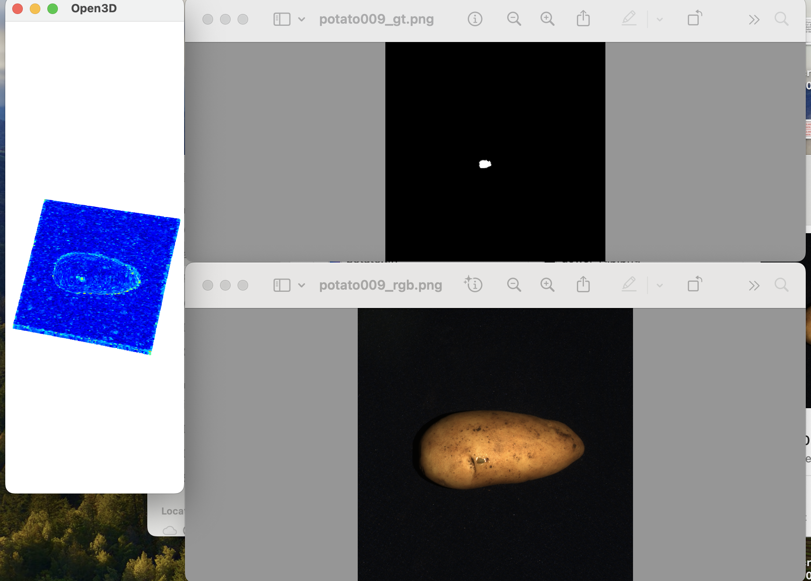

# 3D Point Cloud Anomaly Detection using Knowledge Distillation

This repository contains a project for training a student-teacher knowledge distillation model to perform anomaly detection on 3D point clouds. It leverages the MVTec 3D-AD dataset, and is based on the paper [Anomaly Detection in 3D Point Clouds using Deep Geometric Descriptors](https://arxiv.org/pdf/2202.11660).

## Project Overview

In this project, a teacher model is initially trained on the 3D point cloud data for anomaly detection. The knowledge distilled from this model is then used to train a smaller, more efficient student model. This approach enables the student model to replicate the teacher’s performance with reduced computational complexity, suitable for real-time applications on edge devices.

## Model Parameters

### Input and Architecture
- **n_points**: `16000` - Number of points sampled from each 3D point cloud.
- **k**: `8` - Number of nearest neighbors considered for clustering.
- **d**: `32` - Model input dimension.
- **h_d**: `128` - Latent dimension of the decoder network.
- **m**: `1024` - Number of output points.
- **R**: `3` - Number of residual blocks in the network.

### Training
- **Teacher Model Training Epochs**: `250`
- **Student Model Training Epochs**: `100`

## Results

The model effectively detects anomalies in complex 3D point clouds, providing clear distinctions between anomalous and non-anomalous regions. Each of the four images included showcases different scenarios where the student model successfully identifies anomalies, demonstrating the effectiveness of knowledge distillation in maintaining accuracy even in a lighter model.

